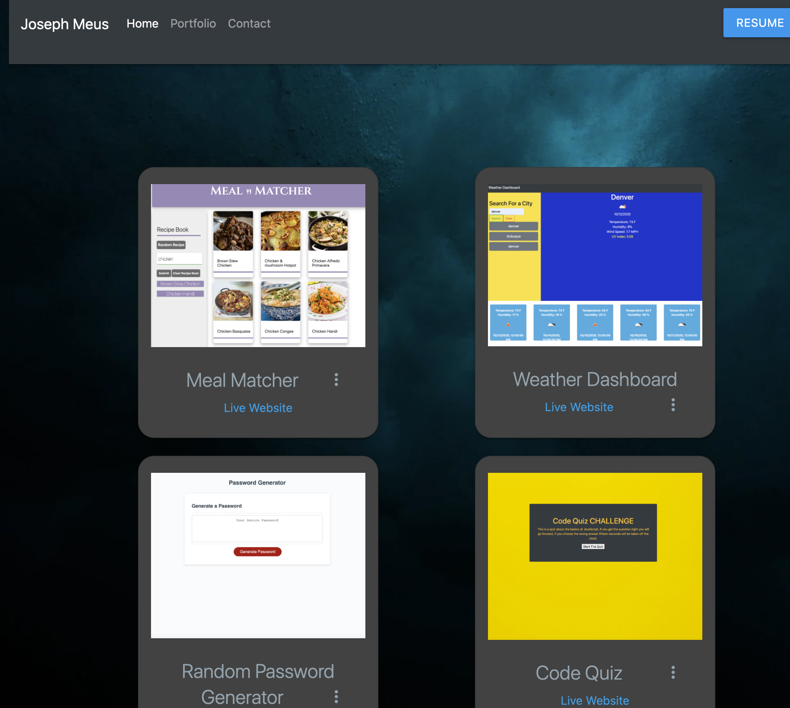

Homework 07 - Portfolio Update

For this homework I updated my original portfolio to include my resume, links to my work done in this class, and links for my github and linkedIn. I also updated my Github account and LinkedIn account to be current to what I am currently searching for.

My goal in this class is to get a job in the web development industry so I hope that these changes will help me stand out and I also plan to continue refactoring my portfolio, changing up my github and linkedIn pages, and working with career services to work towards that goal.

This assignment was not particularly challenging but I am happy that I now have a place where my work is showcased. I worked in Materialize CSS in this refactor because I find Materialize to be more polished than bootstrap personally. 

Live page: https://meusjoseph21.github.io/portfolio-update-hw7/

Github repository: https://github.com/meusjoseph21/portfolio-update-hw7

